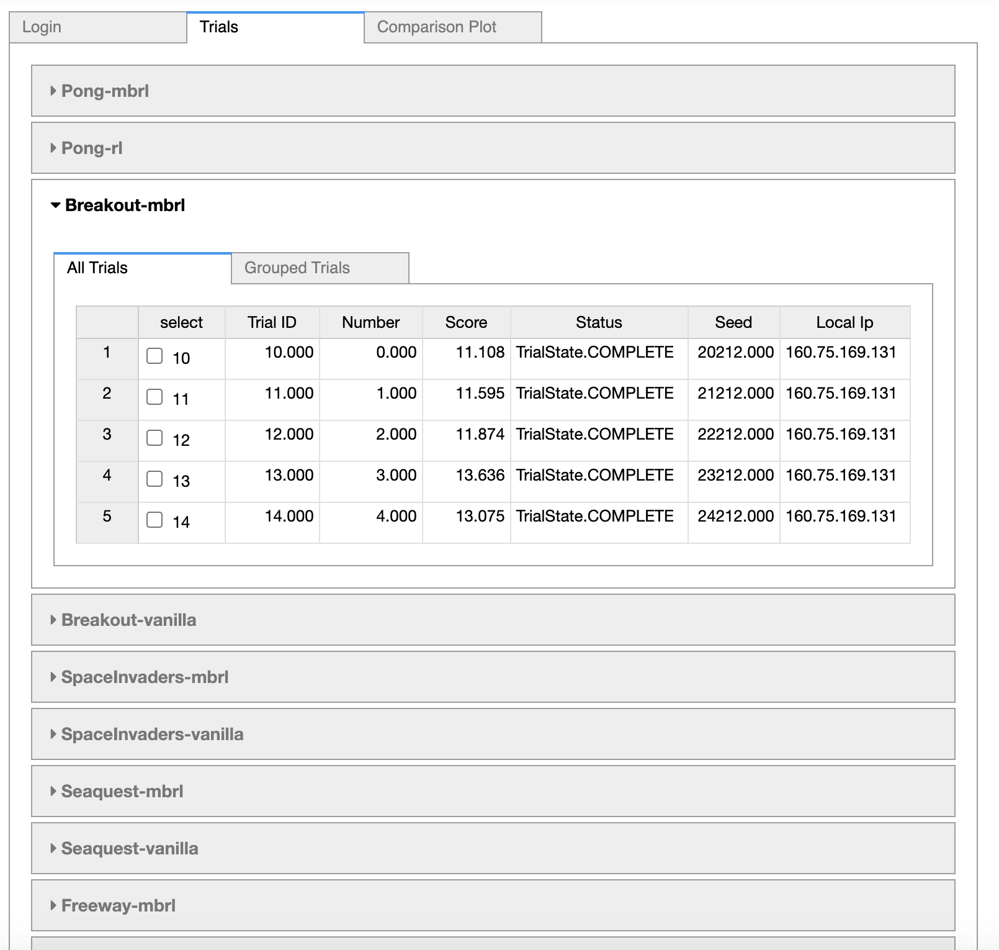
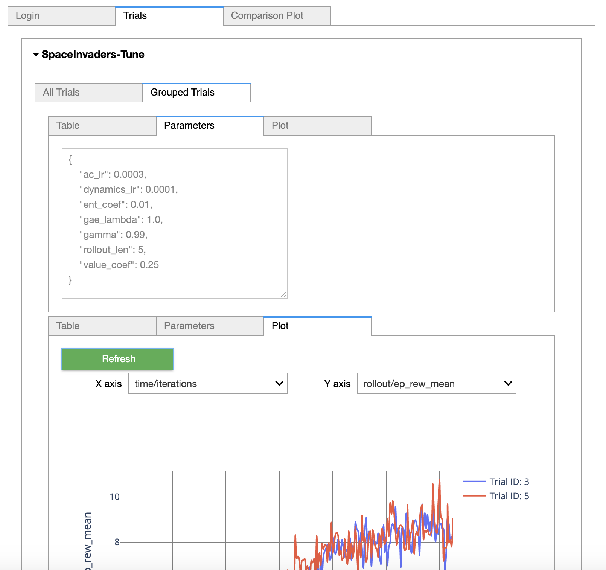

# Empiric Reinforcement Learning

Benchmarking package of common Reinforcement Learning (RL) environments with standardized hyperparameters, models, and visualizations. Also provides hyperparameter tuning and distributed running.

- - -

|  Environment  | Observation Space | Action Space | [Stable Baselines 3](https://github.com/DLR-RM/stable-baselines3)   | [ModularBaselines](https://github.com/TolgaOk/Modular-Baselines) | Ray Rllib |
|:-------------:|-------------------|:------------:|--------------------|------------------|-----------|
|  LunarLander  | Continuous        | Discrete     | :heavy_check_mark: |:heavy_check_mark:|           |
| BipedalWalker | Continuous        | Continuous   | :heavy_check_mark: |:heavy_check_mark:|           |
| CartPole      | Continuous        | Discrete     | :heavy_check_mark: |:heavy_check_mark:|           |
| Atari         | Vision            | Discrete     | :heavy_check_mark: |:heavy_check_mark:|           |

## Distributed Hyperparameter Tuning and Visualization

EmpiricRL uses [Optuna](https://optuna.org/) for hyperparameters search and optimization in a distributed setting. Additionally, EmpricRL offers ready to use examples for [Stable Baselines 3](https://github.com/DLR-RM/stable-baselines3) and [ModularBaselines](https://github.com/TolgaOk/Modular-Baselines).

Widgets connect to a Redis server and render the studies in the server for live visualization.    

Different trials can be combined within a single figure. IF the trials are identical but the seed, the notebook widget combines them in a single trace with shaded regions. The y and x-axes can be selected separately.

## Tuned parameters for Benchmarking

EmpiricRL contains benchmarking scores and tuned hyperparameters for a few gym environments in multiple frameworks and algorithms (currently only for A2C). It can be used for benchmarking custom RL frameworks